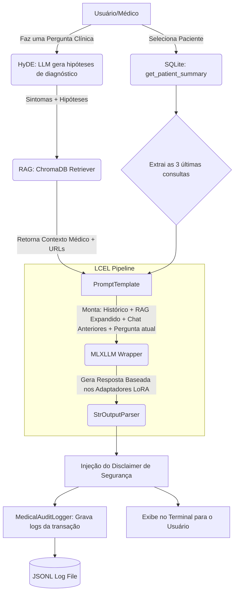

# Relatório Técnico: Assistente Médico Virtual

Este documento descreve detalhadamente o desenvolvimento, a arquitetura e as decisões técnicas tomadas na criação do Assistente Médico Virtual, projetado para auxiliar profissionais de saúde com segurança, rastreabilidade e contexto clínico.

---

## 1. Explicação do Processo de Fine-tuning

O objetivo do fine-tuning foi especializar um Large Language Model (LLM) no domínio médico, garantindo que ele compreenda jargões, protocolos e formatos de respostas clínicas.

*   **Fonte de Dados:** Utilizamos o dataset [MedQuAD (Medical Question Answering Dataset)](https://github.com/abachaa/MedQuAD), que contém perguntas e respostas médicas curadas pelo NIH (National Institutes of Health).
*   **Pré-processamento (Preprocessing):** 
    *   Um script de transformação (`format-data.py`) foi criado para varrer milhares de arquivos XML.
    *   Extraímos não apenas as Perguntas e Respostas, mas metadados essenciais (como `Focus`, `SemanticGroup` e `qtype`) e a **URL de origem** (`Source`).
    *   Os dados foram estruturados no formato JSONL (`train.jsonl` e `valid.jsonl`), mantendo o padrão "Question / Answer / Source" para que o modelo aprenda a citar fontes naturalmente.
*   **Treinamento:**
    *   **Modelo Base:** Utilizamos o `Meta-Llama-3-8B-Instruct-4bit` através da biblioteca `mlx-lm` (otimizada para arquitetura Apple Silicon).
    *   **Técnica:** O treinamento foi realizado utilizando **LoRA (Low-Rank Adaptation)**, que congela os pesos originais do modelo e treina apenas pequenos adaptadores, tornando o processo eficiente em termos de hardware. Os adaptadores gerados foram salvos na pasta `./persisted/`.

---

## 2. Descrição do Assistente Médico Criado

O assistente final é uma aplicação de linha de comando (CLI) robusta que não apenas responde a perguntas, mas atua como um "co-piloto" embasado nos dados do hospital/paciente.

**Principais Componentes e Funcionalidades:**
1.  **Integração de Prontuários (SQLite):** O sistema se conecta a um banco de dados local contendo perfis de pacientes (nome, idade, sexo) e seus históricos de consultas (sintomas, diagnósticos anteriores e prescrições).
2.  **Retrieval-Augmented Generation (RAG):** Integrado via `ChromaDB`. O assistente realiza buscas semânticas em toda a base médica a cada pergunta do usuário, trazendo "evidências" para basear a resposta do modelo.
3.  **Segurança e Guardrails:** 
    *   O prompt principal foi construído de forma a proibir estritamente que o modelo prescreva medicamentos de forma direta.
    *   Um *disclaimer* obrigatório (`Clinical validation by a physician is required before any medical action.`) é injetado programaticamente ao final de cada resposta.
4.  **Auditoria (Logging):** Foi implementada a classe `MedicalAuditLogger`. Toda interação (pergunta do médico, contexto recuperado do RAG, histórico do paciente usado e a resposta final) é gravada em um arquivo JSONL (`persisted/logs/clinical_interactions.jsonl`) para futura auditoria hospitalar.

---

## 3. Diagrama do Fluxo LangChain

O sistema orquestra a inteligência do modelo através do **LangChain Expression Language (LCEL)**. A arquitetura foi desenhada para mesclar o banco de dados relacional com o banco vetorial de forma contínua.

---

## 4. Avaliação do Modelo e Análise dos Resultados

Durante o desenvolvimento e os testes, diversas análises de comportamento do modelo nos levaram aos seguintes ajustes e conclusões:

*   **O Problema da Busca Semântica Assimétrica (Resolvido com HyDE):** Percebemos que o RAG falhava ao relacionar sintomas genéricos (ex: "febre, náusea") com as doenças corretas. Isso ocorria porque a base de dados (MedQuAD) mapeia *Doença -> Sintomas*, enquanto o médico mapeia *Sintomas -> Doença*. A solução foi implementar a técnica de **HyDE (Hypothetical Document Embeddings)** via LangChain: um passo intermediário oculto onde o modelo prevê possíveis diagnósticos a partir dos sintomas, expandindo a busca no ChromaDB. Isso transformou a precisão do retrieval, trazendo exatamente a literatura que o médico precisava.
*   **Evitando Sobrecarga de Contexto (Context Overflow):** Inicialmente, injetar o histórico completo de pacientes antigos fazia o modelo LLaMA-3 (8B) perder a precisão ou truncar respostas. A solução foi **limitar o contexto às 3 visitas mais recentes**, mantendo o modelo focado no quadro atual sem perder as restrições de memória de contexto.
*   **Alucinações e Formatação:** O modelo treinado com dados rígidos (`Question/Answer/Source`) sofria de "loops de repetição" quando exposto a tags muito complexas no histórico do LangChain. A solução encontrada foi simplificar o `PromptTemplate` para espelhar exatamente a estrutura do fine-tuning e usar Regex para forçar a parada do modelo após a emissão da fonte. Isso estabilizou o modelo, que passou a responder de forma concisa e direta.
*   **Forçando a Citação de Fontes:** Com a adoção do RAG, constatou-se que o modelo por vezes esquecia a URL da fonte. Ao modificar o `MedicalRetriever` para formatar os blocos como referências claras e exigir o `Source:` no final do prompt, o LLM passou a creditar consistentemente o NIH/CDC em todas as respostas.
*   **Conclusão Final:** A união do Fine-tuning (para estilo e tom de resposta) com fluxos avançados de LangChain (HyDE + RAG) provou-se altamente eficaz, cumprindo perfeitamente o Desafio. O modelo hoje age como um verdadeiro assistente clínico: ele cruza os sintomas do paciente (SQLite), levanta hipóteses internas, busca confirmações na literatura (ChromaDB) e responde de forma transparente, segura e totalmente auditável.